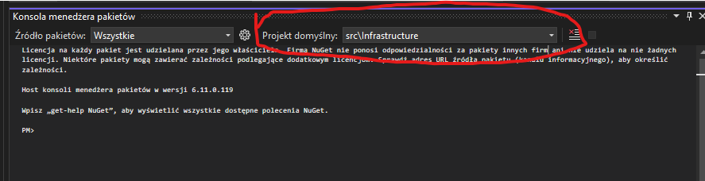
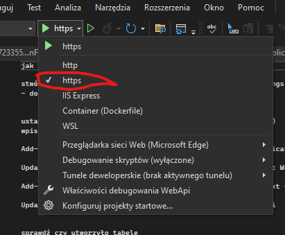

jak uruchomić poradnik dla opornych

1. stwórz dwie bazy danych w projekcie WebaApi w pliku appsettings.json musisz podmienić connection stringi

2. dodaj migracje Package menager console

3. ustaw projekt domyślny na Infrastructure ( góra konsoli PM )



4. wpisz komendy:
```bash
Add-Migration InitialMigrationForApplicationDb -Context ApplicationDbContext -OutputDir Migrations/ApplicationDbMigration -StartupProject WebApi

Update-Database -Context ApplicationDbContext -StartupProject WebApi

Add-Migration InitialMigrationForUserDb -Context UserDbContext -OutputDir Migrations/UserDbMigration -StartupProject WebApi

Update-Database -Context UserDbContext -StartupProject WebApi
```
5. sprawdź czy utworzyło tabele

6 .wybierz profil https



7. uruchom projekt (powinien działać )

w przypadku braku komunikacji z reactem sprawdź konfiguracja portuw (po stronie react pliku \mmm-platform-main\src\api.ts linijka 4 po stronie C# znajduje się to w pliku MarketingMixModeling\WebApi\Properties\launchSettings.json )
